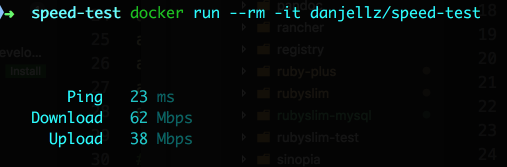

# speet-test
A simple network speed-test in a Docker image

## Basic Functionality

To see basic functionality, run without arguments:

``` bash
docker run --rm -it danjellz/speed-test
```

Output:

``` ruby
       Ping   23 ms
   Download   62 Mbps
     Upload   38 Mbps
```

[]

## Tips

#### Alias
Creating an alias in your `~/.bashrc` or `~/.zshrc` files can make this command much shorter. Example:

``` bash
alias speed-test="docker run -it --rm danjellz/speed-test:latest"
```

Allowing you to run the following to run a test any time:

``` bash
speed-test
```